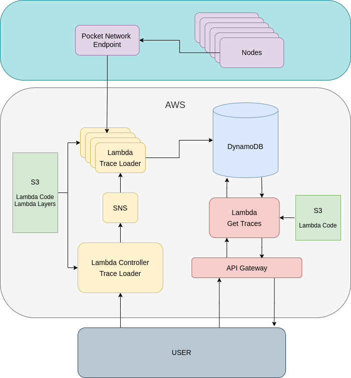

# Ethereum Trace Loading

## Goal
Create a scalable mechanism to load trace data from a subset of Ethereum blocks (eventually all). The storage should be queryable via some URL in a convenient format.

## Ethereum Traces?
Requesting the Ethereum node to reexecute the desired transaction with varying degrees of data collection and have it return the aggregated summary for post-processing.

## Diagram

## Flow
The user edits `load_events.json` then executes `load_blocks.sh`. This fires the lambda controller which fills up our SNS topic with the desired block numbers we want to fetch from Ethereum.
The SNS topic begins invoking the trace loading lambda concurrently (up to 1000 at a time). DynamoDB is set to pay-per-request while we understand credit usage. Now that DynamoDB 
has our data... we can issue requests via URL using `POST` command on `/readBlocks`.

Ex. `curl -X POST -d '{"startBlock": 12914945, "endBlock": 12914950}' https://<URL_BASE>.execute-api.us-east-2.amazonaws.com/dev/readBlocks > out.json`

This would fetch 6 blocks ranging from ...45 to ...50. The results are returned as an array of dictionaries... where each dict key is a block number and each value is an array of traces corresponding to that block.